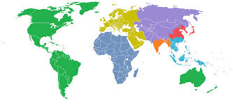

### Hi there 👋
- The above picture shows total world population into seven parts, 1 billion each.
<!--
**khumRegmi/khumRegmi** is a ✨ _special_ ✨ repository because its `README.md` (this file) appears on your GitHub profile.

Here are some ideas to get you started:
-->
- 🔭 I’m currently working on Javascript projects.
- 🌱 I’m currently learning Javascript, and in a few weeks I shall start with NodeJS.
- 👯 I’m looking to collaborate on projects in front and back end development.
- 🤔 I’m looking for help with my projects and homeworks.
- 💬 Ask me about how my love towards porgoramming.
- 📫 How to reach me: khumregmi10@gmail.com.
- ⚡ Fun fact: will add in a few days.

